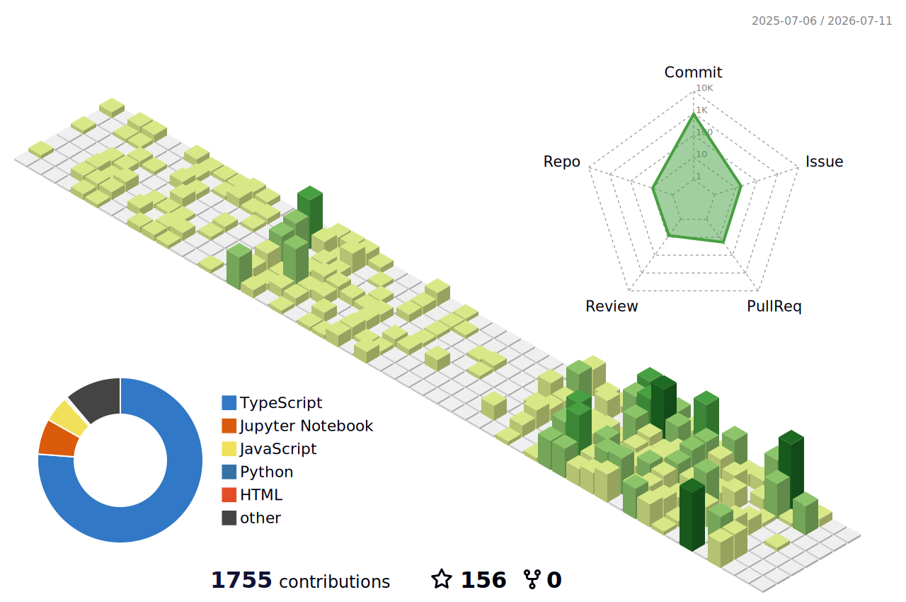

<h1 align="center">Hi 👋, I'm Real Actioner</h1>
<h3 align="center">A passionate Software Engineer & Problem Solver </h3>

 
 

## ✨ About Me

 

- 🔭 9+ years building Full Stack, AI, and Mobile applications in production environments
- 🧠 Build LLM-powered systems and intelligent workflows for real-world use cases
- 🔍 Work on RAG pipelines and semantic search systems over large unstructured datasets
- ⚡ Design low-latency, real-time backend services with a strong focus on performance
- 🏗️ Architect scalable APIs and microservice-based systems with clean, maintainable structure
- ☁️ Deploy and scale applications using AWS cloud and serverless infrastructure
- 🧩 Focus on system design, scalability, and clean architecture principles

 

## 📅 Activity

## 🛠️ Skills

<table border="0" cellspacing="0" cellpadding="12">
  <tr>
    <td valign="top" width="50%">
      <strong>Languages</strong>  
      

        &nbsp;
        &nbsp;
        &nbsp;
        &nbsp;
        &nbsp;
        &nbsp;
        
      

    </td>
    <td valign="top" width="50%">
      <strong>Frontend</strong>  
      

        &nbsp;
        &nbsp;
        &nbsp;
        &nbsp;
        &nbsp;
        &nbsp;
        
      

    </td>
  </tr>
  <tr>
    <td valign="top" width="50%">
      <strong>Mobile</strong>  
      

        &nbsp;
        &nbsp;
        &nbsp;
        &nbsp;
        &nbsp;
        
      

    </td>
    <td valign="top" width="50%">
      <strong>Backend</strong>  
      

        &nbsp;
        &nbsp;
        &nbsp;
        &nbsp;
        &nbsp;
        
      

    </td>
  </tr>
  <tr>
    <td valign="top" width="50%">
      <strong>Databases</strong>  
      

        &nbsp;
        &nbsp;
        &nbsp;
        &nbsp;
        
      

    </td>
    <td valign="top" width="50%">
      <strong>Cloud &amp; DevOps</strong>  
      

        &nbsp;
        &nbsp;
        &nbsp;
        &nbsp;
        
      

    </td>
  </tr>
  <tr>
    <td valign="top" width="50%">
      <strong>AI / ML Core</strong>  
      

        &nbsp;
        &nbsp;
        &nbsp;
        &nbsp;
        &nbsp;
        
      

    </td>
    <td valign="top" width="50%">
      <strong>LLM &amp; Agent Stack</strong>  
      

        &nbsp;
        &nbsp;
        &nbsp;
        &nbsp;
        
      

    </td>
  </tr>
</table>

 

Created with 🧡 by Real Actioner
