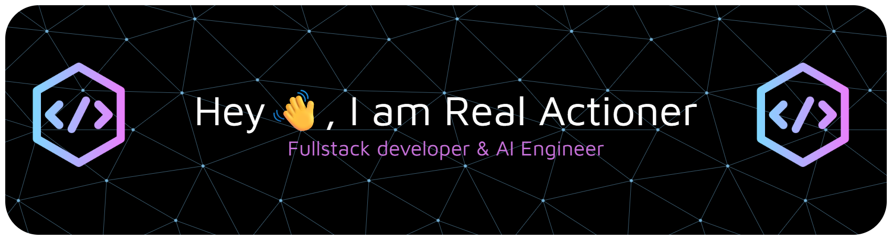

## ✨ About Me

 

- 🧠 Build LLM-powered systems and intelligent workflows for real-world use cases
- 🔍 Work on RAG pipelines and semantic search systems over large unstructured datasets
- ⚡ Design low-latency, real-time backend services with a strong focus on performance
- 🏗️ Architect scalable APIs and microservice-based systems with clean, maintainable structure
- ☁️ Deploy and scale applications using AWS cloud and serverless infrastructure
- 🧩 Focus on system design, scalability, and clean architecture principles

 

## 📅 Activity

## 🛠️ Skills

<table align="center" width="100%">
  <colgroup>
    <col span="8" width="12.5%" />
  </colgroup>
  <tr>
    <td align="center" width="90">
       Python
    </td>
    <td align="center" width="90">
       TypeScript
    </td>
    <td align="center" width="90">
       JavaScript
    </td>
    <td align="center" width="90">
       C
    </td>
    <td align="center" width="90">
       C++
    </td>
    <td align="center" width="90">
       Java
    </td>
    <td align="center" width="90">
       Go
    </td>
    <td align="center" width="90">
       HTML
    </td>
  </tr>
  <tr>
    <td align="center" width="90">
       CSS
    </td>
    <td align="center" width="90">
       React
    </td>
    <td align="center" width="90">
       Next.js
    </td>
    <td align="center" width="90">
       Redux
    </td>
    <td align="center" width="90">
       Tailwind&nbsp;CSS
    </td>
    <td align="center" width="90">
       Material&nbsp;UI
    </td>
    <td align="center" width="90">
       React&nbsp;Native
    </td>
    <td align="center" width="90">
       Flutter
    </td>
  </tr>
  <tr>
    <td align="center" width="90">
       Dart
    </td>
    <td align="center" width="90">
       Kotlin
    </td>
    <td align="center" width="90">
       Swift
    </td>
    <td align="center" width="90">
       Android&nbsp;Studio
    </td>
    <td align="center" width="90">
       Node.js
    </td>
    <td align="center" width="90">
       Express
    </td>
    <td align="center" width="90">
       FastAPI
    </td>
    <td align="center" width="90">
       Flask
    </td>
  </tr>
  <tr>
    <td align="center" width="90">
       Django
    </td>
    <td align="center" width="90">
       GraphQL
    </td>
    <td align="center" width="90">
       MongoDB
    </td>
    <td align="center" width="90">
       MySQL
    </td>
    <td align="center" width="90">
       PostgreSQL
    </td>
    <td align="center" width="90">
       DynamoDB
    </td>
    <td align="center" width="90">
       AWS
    </td>
    <td align="center" width="90">
       Azure
    </td>
  </tr>
  <tr>
    <td align="center" width="90">
       Docker
    </td>
    <td align="center" width="90">
       Kubernetes
    </td>
    <td align="center" width="90">
       Kafka
    </td>
    <td align="center" width="90">
       Git
    </td>
    <td align="center" width="90">
       PyTorch
    </td>
    <td align="center" width="90">
       PyCharm
    </td>
    <td align="center" width="90">
       Anaconda
    </td>
    <td align="center" width="90">
       TensorFlow
    </td>
  </tr>
  <tr>
    <td align="center" width="90">
       OpenCV
    </td>
    <td align="center" width="90">
       MATLAB
    </td>
    <td align="center" width="90">
       OpenAI
    </td>
    <td align="center" width="90">
       LangChain
    </td>
    <td align="center" width="90">
       LangGraph
    </td>
    <td align="center" width="90">
       CrewAI
    </td>
    <td align="center" width="90">
       Hugging&nbsp;Face
    </td>
    <td align="center" width="90">
       VS&nbsp;Code
    </td>
  </tr>
</table>

 

Created with 🧡 by Real Actioner

